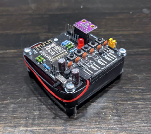

# Project Kawa Devboard

Documentation for the **Project Kawa Devboard**. This repository contains everything the Wifi-Client requires, including code, circuit design and housing.


[](https://www.arduino.cc/)
[](https://www.arduino.cc/en/software)

[](https://www.python.org/)
[](https://www.python.org/downloads/)




## Table of contents

- [Project Kawa Devboard](#project-kawa-devboard)
  - [Table of contents](#table-of-contents)
  - [1 Description](#1-description)
  - [2 Usage](#2-usage)
    - [2.1 LED indicator](#21-led-indicator)
    - [2.2 Setup wifi](#22-setup-wifi)
    - [2.3 Reading sensor data](#23-reading-sensor-data)
  - [3 Hardware](#3-hardware)
    - [3.1 Board](#31-board)
    - [3.2 Housing](#32-housing)
  - [4 Environment](#4-environment)
    - [4.1 Used software](#41-used-software)
    - [4.2 VS-Code setup](#42-vs-code-setup)
      - [4.2.1 code-workspace](#421-code-workspace)
      - [4.2.2 arduino.json](#422-arduinojson)
      - [4.2.3 c_cpp_properties.json](#423-c_cpp_propertiesjson)
    - [4.3 Eagle libraries](#43-eagle-libraries)
  - [5 Building & Debugging](#5-building--debugging)
    - [5.1 Initial upload](#51-initial-upload)
    - [5.2 OTA upload](#52-ota-upload)
    - [5.3 Build the firmware](#53-build-the-firmware)
    - [5.4 Build the filesystem](#54-build-the-filesystem)
    - [5.5 Debug](#55-debug)
  - [6 License & Disclaimer](#6-license--disclaimer)
  - [7 Changelog](#7-changelog)
    - [7.1 Firmware](#71-firmware)
    - [7.2 Filesystem](#72-filesystem)
    - [7.3 PCB](#73-pcb)
  - [8 To Do](#8-to-do)

## 1 Description

**Project Kawa Devboard** is part of the **Project Kawa** environment. This client is designed to test new sensors or new firmware, to debug code or find optimizations in the PCB layout. The latest version may not work without failures, nightly build.

This repository contains mostly code that is in development, as well as hardware-design that might only work under special conditions or differ from this documentation. This is not an out-of-the-box solution and requires some knowledge in a variety of fields. If you don't have an education in the field of electronics you should not proceed with this project, you might harm yourself or create damage by the risk of fire. Further you should be comfortable working with VS Code Workspaces.

Please note: All paths and settings are described for Windows. Will be expanded in the future.

## 2 Usage

**This requires a working build of the firmware and filesystem already flashed to the chip, see [Initial Upload](#51-initial-upload)**. Please note: The description can differ from the actual process, depending on the development state of this device.

### 2.1 LED indicator

There are different kinds of LED-states to indicate the device's status:

- Short, almost unnoticeable blink: Wakeup from deepsleep, running normal cycle
- Rapid blinking 25 times: Wifi is not setup (this should happen after the initial upload)
- Rapid blinking 2 times: Changes have been written to the config
- On-Off every one second: Wifi-setup is running, hotspot is open

### 2.2 Setup wifi

The device needs to connect to your local network via 2.4GHz wifi. To setup your network's credentials you need to

- press and hold **BUTTON 1**
- click the **RESET** button
- the device opens a hotspot called **kawa setup**
- connect any wifi-enabled device to it
- enter your network-credentials
- select the connected sensor
- select the sleep interval (shorter intervals should only be used for testing and debugging)
- reset the controller afterwards

Now your *Kawa Devboard* is ready for use. As soon as the device connects to your wifi it will automatically connect to the server by its own, assuming that the server is running.

Note: The captive portal may not work properly, if so try:

- Use another device
- Click **yes** if your device asks you to stay connected (happens when the device notices, that no internet connection is available)
- Refresh the captive portal redirection page (sometimes the script or the stylesheet aren't loaded properly)
- Enter the IP address **1.2.3.4** manually into a browser

### 2.3 Reading sensor data

Once the wifi credentials are set up correct the device starts its main task: reading sensor data. There is no further interaction needed.

## 3 Hardware

The core of this application is a ESP12F SOC by [espressif](https://www.espressif.com/en/products/socs/esp8266).

### 3.1 Board

The board is a two layered pcb, with mostly push-through components. This is due to easier hacking into the system, when something new needs testing without making a new pcb.

A complete bill of material can be found inside the [bom folder](docs/bom/).
For the production files select the latest zip-file inside the boards folder.

**Important note**: There is no deep discharge protection for the battery. Do not use non-protected batteries with this setup!

### 3.2 Housing

The housing is made with a 3D printer, files can be found inside the projects cad folder. More information will be added.

## 4 Environment

### 4.1 Used software

- The firmware is created with [VS Code](https://code.visualstudio.com/download) with the [Arduino-Core](https://www.arduino.cc/en/software) (extension: CTRL+P -> *ext install vscode-arduino*))
- The content of the filesystem is compiled with [mkspiffs](https://github.com/igrr/mkspiffs) and uploaded with [esptool](https://github.com/espressif/esptool).
- The pcb design is done with [Autodesk Eagle 9.6.2](https://www.autodesk.de/products/eagle/free-download), but may be continued with [EasyEDA](https://easyeda.com/) due to a better library-to-production support.

A full list of the used software, including versions, libraries and tools can be found at the top of the [src.ino](code/src/src.ino).

### 4.2 VS-Code setup

#### 4.2.1 code-workspace

Workspace-root is the repository-root. All relative paths are from this directory. Add the repository-root to a new workspace and save this workspace (can be saved inside or outside of the repo).

#### 4.2.2 arduino.json

Stored inside the **.vscode/** folder. This folder does not exist when cloning the repo and should appear automatically after creating the workspace, if not:

- Create it: [command-palette](https://code.visualstudio.com/docs/getstarted/userinterface#_command-palette) -> *Arduino: Initialize*
- Edit it: [command-palette](https://code.visualstudio.com/docs/getstarted/userinterface#_command-palette) -> *Arduino: Board Config*

Take the current board config from the description at the top of the [src file](code/src/src.ino).

Add the following lines to the json-file:

```json
  "sketch": "code\\src\\src.ino",
  "output": "code\\build\\firmware\\latest",
```

For the Arduino-Board-Config see the header-comment of the src-file.

#### 4.2.3 c_cpp_properties.json

Stored inside the **.vscode/** folder, create (or add):

```json
"configurations": [
    {
        "name": "Win32",
        "intelliSenseMode": "gcc-x64",
        "includePath": [
            "${workspaceRoot}\\code\\src\\",
            "${workspaceRoot}\\code\\src\\headers\\**",
            "C:\\Program Files (x86)\\Arduino\\hardware\\arduino\\avr\\cores\\arduino\\**",
            "${env:LOCALAPPDATA}\\Arduino15\\packages\\esp8266\\tools\\**",
            "${env:LOCALAPPDATA}\\Arduino15\\packages\\esp8266\\hardware\\esp8266\\3.0.0\\**",
            "${env:LOCALAPPDATA}\\Arduino15\\packages\\esp8266\\hardware\\esp8266\\3.0.0\\libraries\\**",
            "${env:HOMEPATH}\\Documents\\Arduino\\libraries\\ArduinoJson\\**",
            "${env:HOMEPATH}\\Documents\\Arduino\\libraries\\DallasTemperature\\**",
            "${env:HOMEPATH}\\Documents\\Arduino\\libraries\\OneWire\\**",
            "${env:HOMEPATH}\\Documents\\Arduino\\libraries\\Adafruit_Unified_Sensor\\**",
            "${workspaceRoot}\\code\\assets\\libraries\\Adafruit_BME280_Library\\**"
        ],
        "forcedInclude": [
            "C:\\Program Files (x86)\\Arduino\\hardware\\arduino\\avr\\cores\\arduino\\Arduino.h"
        ],
        "cStandard": "c11",
        "cppStandard": "c++17",
        "defines": []
    }
]
```

Please note: Some include-paths are only valid if you have chosen the standard path when you installed the Arduino-IDE on a Windows computer.

### 4.3 Eagle libraries

Can be found inside the pcb-folder. Must not be added to EAGLE if you don't plan on changing the board.

## 5 Building & Debugging

Tested and released firmware and filesystem versions can be found inside the respective folder

- [Firmware](code/build/firmware/)
- [Filesystem](code/build/filesystem/)

Those firmware-versions with the letter **d** after the version indicator are debug-versions. This means that you can hookup a serial-to-usb chip and get debug messages printed to a serial monitor. Baud-rate is always 115200. Versions without that letter are for production environment, you won't get any messages printed to the serial port.

### 5.1 Initial upload

To flash the firmware and filesystem initially you need to upload both with a usb-to-serial converter (popular method: use a [FTDI232 module](https://ftdichip.com/drivers/)). The upload process requires you to

- press and hold the **UPLOAD** button
- press and release the **RESET** button
- release the **UPLOAD** button as soon as the upload begins
- click the **RESET** button after the upload is done

The initial firmware can be uploaded with the command-palette -> *Arduino: Upload*.

The initial filesystem can be uploaded with *[SPIFFS for Arduino](https://github.com/esp8266/arduino-esp8266fs-plugin/releases)*.

### 5.2 OTA upload

New firmware/filesystem will be automatically installed by the **Project Kawa Server**. With every post-request (device -> server) the server answers with the newest firmware/filesystem version. If the current one is older the device will download and install the latest one. This process is called OTA.

This requires a working initial firmware to be flashed onto the device, see [Initial Setup](#51-initial-upload).

In order for the OTA to work you then have to copy the newest firmware/filesystem into the server's bin-directory. Please refer to the server's documentation for the correct filename or use the [test server](code/dev/test_server/test_server.py) from the **/dev** folder. The test server returns only the file set at the top-section. Do not use the test server in a production environment.

### 5.3 Build the firmware

The firmware is built when the src-file is compiled without any errors (command-palette -> *Arduino: Verify*). The binary file is then stored inside the latest-folder of build-directory, as instructed in the *4.2.2 arduino.json*.

### 5.4 Build the filesystem

Currently in testing.

### 5.5 Debug

To debug the firmware uncomment the **#define DEBUG** statement inside the [definitions.h](code/src/headers/definitions.h) file. Connect a serial-to-usb device to the RX-TX pins of the device, upload the changed code and open the serial monitor with 115200 baud rate.

To debug the captive portal content (files inside the [data folder](code/src/data/)) you can use any static file server. Tip: Run Python's builtin module **python -m http.server** inside the data folder.

## 6 License & Disclaimer

No license. Currently closed source.

All content on this repository is provided **as is**. None of these components have been tested or certified. The use of this content is **at your own risk**.

## 7 Changelog

### 7.1 Firmware

**v0.0.0**: Creation.

### 7.2 Filesystem

**v0.0.0**: Creation.

### 7.3 PCB

**Rev0**: Creation.

## 8 To Do

- [ ] Fix: Wifi settings are overwritten when filesystem gets updated.
- [ ] Fix: Slow/laggy captive portal.
- [ ] Fix: Replace FS with LittleFS.
- [ ] Add: Switch sensor.
- [ ] Add: Air quality sensor.
- [ ] Add: Rain sensor (amount and state).
- [ ] Add: Moisture sensor.
- [ ] Add: Analog input (may require additional hardware).
- [ ] Test: Relay output (requires additional hardware).
- [ ] Test: LED controller (requires additional hardware).
- [ ] Test: Deep discharge protection (requires additional hardware).
